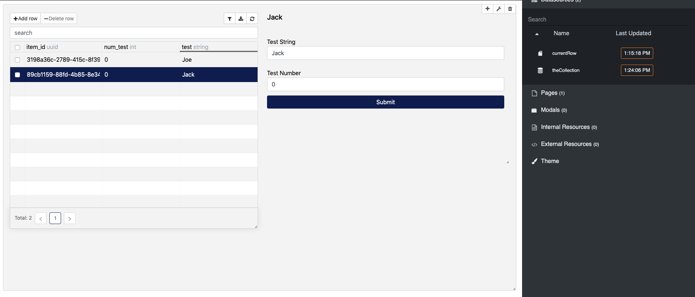

# CRUD Grid Example

This example shows how to connect a CRUD Grid widget to a collection datasource to achieve the following:

1. Display collection rows in the grid
2. Filter/search/sort collection data from the grid UI
3. Add new items to the collection
4. Update items in the collection
5. Delete items from the collection
6. Export the collection data to a .csv file
7. Highlight a row in the grid and update a `local variable` datasource

All parser code was provided by the defult parsers for the collection datasource. Check out `/portals/CRUD_Grid_Example/config/widgets/CrudgridWidget_94131775-6fdd-43fd-9ef3-bbe2566aa55f` for more information on the parser code.

